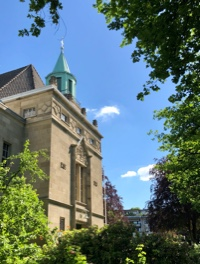
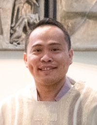

  <h3>Ash Wednesday Mass Schedule in Hamburg</h3>
  Note: There is no English Mass for Ash Wednesday. However, there will be Ash distribution on Sunday, Mar 9th during the regularly scheduled English Mass.
    <ul>
      <li>7:00  at <a href="https://maps.app.goo.gl/LsgPXH77BzZm5cCLA">Sankt Sophien</a> in German</li>
      <li>7:30  at <a href="https://maps.app.goo.gl/2SmFWFWqM62a91Uq6">Ansgar Kapelle</a> in German</li>
      <li>12:30 at <a href="https://maps.app.goo.gl/BdzJvrtQpkdN1rpf6">Mariendom</a> in German</li>
      <li>15:00 at St. Elisabeth's in German</li>
      <li>18:00 at <a href="https://maps.app.goo.gl/LsgPXH77BzZm5cCLA">Sankt Sophien</a> in German</li>      
      <li>18:00 at <a href="https://maps.app.goo.gl/5F3rHNV2JRh1Q8Xa7">St. Bonifatius</a> in German</li>
      <li>18:15 at <a href="https://maps.app.goo.gl/BdzJvrtQpkdN1rpf6">Mariendom</a> in German</li>
      <li>19:00 at <a href="https://maps.app.goo.gl/m57VotVLsszFqAPP8">St. Antonius</a> in German</li>
      <li>19:00 at <a href="https://maps.app.goo.gl/8skM3wEtvJFfzc19A">Kleiner Michel</a> in German</li>
      <li>19:30 at <a href="https://maps.app.goo.gl/LsgPXH77BzZm5cCLA">Sankt Sophien</a> by the Ghana Catholic Mission</li>
      </ul>

<!--

  <h3>Lenten and Holy Week Mass Schedule</h3>  
    <ul>
      <li>Palm Sunday (24 March) - English mass at 12:00 noon</li>
      <li>Holy (Maundy Thursday (28 Mar) - No English mass</li>
      <li>Good Friday (29 Mar) - Celebration of the Lord’s Passion, including the Passion reading, solemn intercessions, and adoration of the Holy Cross at 5:30 PM</li>
      <li>Holy Saturday (30 Mar) - No English mass</li>
      <li>Easter Sunday (31 Mar) - English mass at 12:00 noon</li>
      <li>Easter Monday (1 Apr) - No English mass</li>
      </ul>

-->

## Welcome!

We are a vibrant community of English-speaking Catholics from across the globe.
Whether you are moving to Hamburg permanently, on a temporary assignment, or just passing through the city as a traveler, you are welcome to celebrate mass with us in English.
To stay up to date on activities and opportunities, please subscribe to our [monthly email newsletter](/newsletter).

## Mass Time and Location
Mass is held in English at 12:00 noon every Sunday at St. Elisabeth Church at Oberstraße 67 in Hamburg.

  <iframe width="800" height="400" id="gmap_canvas" src="https://maps.google.com/maps?q=Kath.%20Kirchengemeinde%20St.%20Elisabeth%20Hamburg&t=&z=13&ie=UTF8&iwloc=&output=embed" frameborder="0" scrolling="no" marginheight="0" marginwidth="0"></iframe>

## Our Pastor

Fr. Ritchille Salinas, SVD has been the pastor of the English-speaking community at St. Elisabeth since January 2020.
Fr. Ritchille is originally from the Philippines, and arrived in Germany in 2008 to study Catholic theology at the Kölner Hochschule für Katholische Theologie and at Ludwig Maximilian University in Munich.
He was ordained to the priesthood in Sankt Augustin near Bonn in 2014, working in German parishes in Augsburg and Dresden during his pastoral years.
Fr. Ritchille accepted his first assignment from 2016 to January 2020 as an assistant parish priest in Obersendling-Waldfriedhof in Munich.
In Hamburg, he is responsible for our English-speaking community, the Filipino Catholic Community, and is undertaking his first work as port chaplain for the Stella Maris Catholic Seafarers mission of the Archdiocese of Hamburg.
