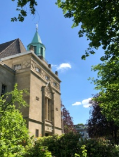
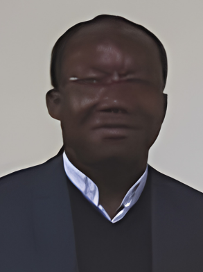

## Welcome!

We are a vibrant community of English-speaking Catholics from across the globe.
Whether you are moving to Hamburg permanently, on a temporary assignment, or just passing through the city as a traveler, you are welcome to celebrate mass with us in English.
To stay up to date on activities and opportunities, please subscribe to our [monthly email newsletter](/newsletter).

## Mass Time and Location
Mass is normally held in English at 12:00 noon every Sunday at St. Elisabeth Church at Oberstraße 67 in Hamburg.

  <strong>Please note:</strong> There will be no English Mass until Sunday, 4 October, while interior painting work is underway at St. Elisabeth Church.
  
During this time, you are welcome to attend the 3:30 p.m. Filipino Mass at Kleiner Michel or the 12:30 p.m. Ghanaian Mass at Sankt Sophien; both are partly in English.

  <iframe width="800" height="400" id="gmap_canvas" src="https://maps.google.com/maps?q=Kath.%20Kirchengemeinde%20St.%20Elisabeth%20Hamburg&t=&z=13&ie=UTF8&iwloc=&output=embed" frameborder="0" scrolling="no" marginheight="0" marginwidth="0"></iframe>

## Our Pastor

Fr. Germain hails from Cameroon. Before coming to us, he was based in Husum as part of the regional ministry team for Northern Schleswig-Holstein. He served as a tourism chaplain along the North Sea coast, offering pastoral care and services to seasonal travelers and holiday-makers visiting the area. We are delighted that the continued flourishing of his pastoral calling will happen with us.

**Email:** [germain.gouen@erzbistum-hamburg.de](mailto:germain.gouen@erzbistum-hamburg.de)

**Office hours:** Wednesdays and Thursdays, 10:00 am–4:00 pm (in the office at St. Elisabeth)

**Sunday confession:** 10:30 am–11:30 am
