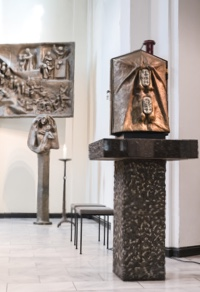

Our community relies on the time and energy of all its members.
Please get involved if you can.

## Liturgical Service
For those interested in serving in the liturgy as a lector or eucharistic minister, please contact Anna Baumann after Mass.

## Musical Choirs
Our community has two instrumental choirs which lead the singing during mass on alternating Sundays.
If you are interested in joining, please approach one of the choir leaders after mass.

## Hospitality
The Hospitality team strives to create a welcoming atmosphere for visitors and new parishioners, and organizes our monthly after-mass coffee event for all parishioners.
If you’re interested in helping improve the hospitality of our parish, please contact [hospitality@hamburg-catholics.de](mailto:hospitality@hamburg-catholics.de).  

## Children’s Liturgy
A special Children’s Liturgy during mass is available every month on the last Sunday of the month.
All children who have not received their First Holy Communion can participate; just seat them in the first two rows of the church, and they’ll leave after the procession with the teachers.
The children are taken to the Parish Hall to hear that day’s liturgy in a fun and enjoyable manner, usually including some fun activities.

## Children’s Catechism
Catechism classes are available for kids between 8 and 15 years old every 1st and 3rd Sunday from 10:30 am - 11:30 am in the Parish Hall.
We teach the children about our faith and try to instil a love for Jesus and his church.
Catechism is also a precursor for anyone who would like to receive First Holy Communion.
If you’d like to join, please contact [catechism@hamburg-catholics.de](mailto:catechism@hamburg-catholics.de).

## Rite of Christian Initiation of Adults
RCIA is a formation program for all those interested in becoming Catholic and for adult Catholics who have never been confirmed.
Please speak to Fr. Ritchille after mass if you are interested in this program.

## Young Adults
We have a Young Adults group for anyone 18 and older who share our faith, study the Bible, worship, and pray.
We meet on every third Sunday after mass in the Parish Hall, usually for about an hour.
It’s a great opportunity for anyone new to the faith or to Hamburg to get to know like-minded young adults.
If you’d like to join, please contact [young-adults@hamburg-catholics.de](mailto:young-adults@hamburg-catholics.de).

## Leadership
The English-speaking community has a small leadership group that helps coordinate the activities of the community and provide for its administrative needs.
If you’re interested in being part of the leadership group, or if you would like to start a new ministry or activity, please contact [leadership@hamburg-catholics.de](mailto:leadership@hamburg-catholics.de).
