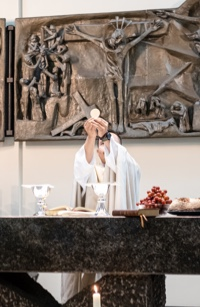

All Sacraments are available to parishioners in English.

## Baptism
Baptism for infants/children usually takes place during Sunday mass.
For infant/child baptism, please contact the secretary of Sankt Elisabeth, Frau Stephania Trost at 040 696 3838 70 or info@st-elisabeth-hh.de.
Please make contact at least 6 weeks before you would like the baptism to take place.
After you have contacted Frau Trost and signed the registration form, Fr. Ritchille Salinas will contact you to discuss and plan the baptism.

Baptism for adults is possible through the Rite of Christian Initiation of Adults (RCIA).
If you are interested in joining the church as an adult, please contact Fr. Christian Modemann, SJ at [Catholic Faith Information](https://pfarrei-edith-stein.de/KGI/Team__3550) (KGI: Katholische Glaubensinformation) Hamburg at 0162 13 53 261 or modemann@kgi-hh.de.

## Confession
Confession is available every Sunday before mass starting at 11:00.
Due to COVID-19, please pre-register with Fr. Ritchille Salinas at svdsalinas@gmail.com.
Confessions are being heard in the parish hall (Gemeindehaus) during the pandemic.

## Eucharist
Children or adults who are interested in being prepared for first holy communion should contact Mario Stallone at TBD to find out about when the next round of classes will take place.

If you or a family member cannot attend Mass and would like to have the Eucharist brought to your home, please contact Fr. Ritchille Salinas at svdsalinas@gmail.com.

## Confirmation
Children or adults who are interested in being prepared for confirmation should contact Sandra de Menezes at sandemen@hotmail.com to find out about when the next round of classes will take place.

## Marriage
Couples who are interested in being prepared for marriage and/or married at St. Elisabeth should contact the secretary of Sankt Elisabeth, Frau Stephania Trost at 040 696 3838 70 or info@st-elisabeth-hh.de.
Please make contact at least 6 months before your expected wedding date.
Fr. Ritchille Salinas will contact you to discuss and plan the wedding after you have successfully registered through the secretary.

## Anointing of the sick
Anointing of the sick is available to parishioners who are nearing the end of their life, struggling with chronic illness, or coping with extreme emotional illness.
To request to be anointed at the parish, at the hospital, or in your home, please contact Fr. Ritchille Salinas at svdsalinas@gmail.com or 0151 65178120.

## Sacramental Documents
If you would like a copy of a certificate for a sacrament that has taken place in the past, please contact the secretary of Sankt Elisabeth, Frau Stephania Trost at 040 696 3838 70 or info@st-elisabeth-hh.de.

If you are a parishioner who will receive a sacrament at another parish, you will be asked to provide a "Entlassschein" or Dimissoriale (certificate that allows you to do the sacrament at another parish).
To get this certificate, please contact the secretary of Sankt Elisabeth, Frau Stephania Trost at 040 696 3838 70 or info@st-elisabeth-hh.de.
The letter will be sent directly to the church where the sacrament will take place, and a copy will be sent to you for your records.
